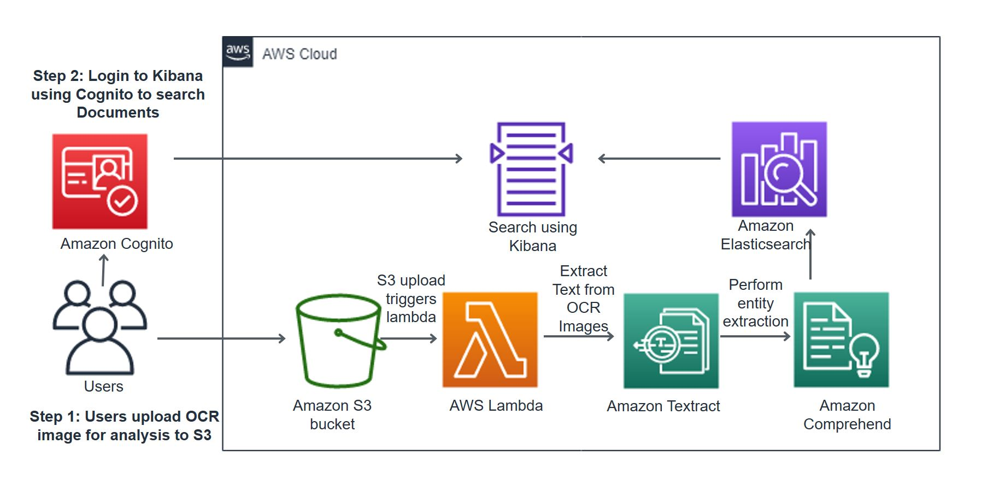

## Amazon Textract Comprehend Image Search with Elasticsearch
We will be using Amazon Textract, Amazon Comprehend, Amazon Elasticsearch with Kibana, Amazon S3,  Amazon Cognito to search and analyze over large number of images.
## Deploying CloudFormation Template

We will start by deploying an AWS CloudFormation template to provision the necessary AWS Identity and Access Management (IAM) role and Lambda function needed in order to interact with the Amazon S3, AWS Lambda, and Amazon Comprehend APIs.
	Region	Region Code	Launch
1	US East 
(N. Virginia)	us-east-1

#Architecture
-----------

Architecture below shows the core components. 

## Image pipeline

1. User uplaods data in Amazon S3.
2. This event triggers a lambda function to call Textract.
3. Textract extract text from images.
4. Text is analyze by Amazon Comprehend.
5. Analyzed Result is stored in elasticsearch for search and analysis.
6. User logs in using Cognito to Kibana- Elasticsearch dashboard and analyzes the OCR data in the image.

## License Summary
This sample includes:

The documentation is made available under the Creative Commons Attribution-ShareAlike 4.0 International License. See the LICENSE file.
